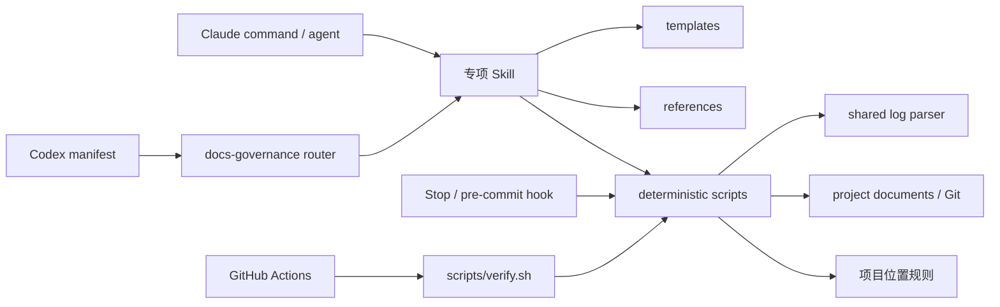
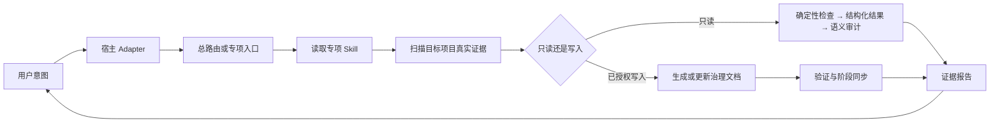

# ARCHITECTURE.md — docs-governance 当前架构

> 本文是插件**当前架构**的唯一说明入口。设计选择及其理由在 `docs/adr/README.md`；文件定位与误导清单在 `CLAUDE_MAP.md`；方法论唯一源仍在 `skills/*/SKILL.md`。

## 架构摘要

插件以 `skills/` 为窄腰：Claude Code、Codex 与 ChatGPT 各自通过宿主 Adapter 进入同一套方法论，命令和 agent 不复制方法论。规则、决策与历史保存在项目文档；接口字段以机器契约为准，执行结论以对应版本的运行证据为准。Markdown 登记这些证据的入口与解释，派生索引不替代原文。

## Module 权责与状态归属

| Module | 唯一职责 | 状态归属 | 对外 Interface | 允许依赖 | 禁止依赖 |
|---|---|---|---|---|---|
| 宿主 Adapter | 把 Claude Code、Codex、ChatGPT 的入口转换为统一 Skill 调用 | 无持久状态 | manifest、command、agent 调用约定 | 总路由与专项 Skill | 持有或复制方法论 |
| 总路由 | 根据用户意图选择专项 Skill 和执行顺序 | 无持久状态 | `skills/docs-governance/SKILL.md` | 专项 Skill | 复制专项方法论 |
| 专项 Skill | 保存治理方法论唯一真相 | 无运行时状态 | 各 `skills/*/SKILL.md` | 模板、参考与确定性脚本 | 宿主专用实现 |
| 模板与参考 | 提供空白载体和同步矩阵 | 无运行时状态 | `templates/`、`references/` | 无 | 反向依赖 agent 或 command |
| 日志格式 | 统一事件识别、原文边界及格式错误 | 无持久状态 | `scripts/logformat.py` 的 `parse_entries` / `Entry` / `LogFormatError` | Python 标准库 | 文件读写、CLI 退出、审计或归档策略 |
| 确定性执行 | 检查事实、生成结构化结果，并按需渲染文字或 JSON | 结果在本次内存中；`.governance/` 只保存可重建派生状态 | `scripts/`、`hooks/`、`.github/workflows/verify.yml` | 日志格式、项目文档、Git | 把派生索引或旧运行结果当当前事实 |

## 代码依赖图

> 箭头表示左侧实现依赖右侧 Interface。方法论依赖只能从宿主入口指向 Skill，不能把方法论复制回 command 或 agent。

## 运行时核心流转图

> 这张图表示运行时工作流，不代表代码依赖。审计默认只读；写入必须来自用户授权。

## Interface 与 Adapter 证据

| Interface / Seam | 定义位置 | Adapter / 调用方 | 约束唯一来源 |
|---|---|---|---|
| 插件发现 | `.claude-plugin/plugin.json`、`.codex-plugin/plugin.json` | Claude Code、Codex / ChatGPT | 双端 manifest |
| 方法论执行 | `skills/*/SKILL.md` | commands、agents、当前 Codex agent | 对应 Skill |
| 项目文档生成 | `templates/*.example.md` | docs-governor 或当前 agent | 模板 + 对应 Skill |
| 机器契约模板 | `templates/openapi.example.json` | CONTRACT 模板、消费方/提供方校验器 | 单一 OpenAPI 文档 |
| 日志解析 | `scripts/logformat.py` | 文档审计、日志归档与索引 | 同一解析器，调用方决定失败处理 |
| 文件位置与触发规则 | `.docs-governance.json`、`scripts/docpolicy.py` | Stop、暂存区检查、full/artifacts 审计 | [规则接口](references/document-policy.md) |
| 确定性审计 | `scripts/audit-cheap.sh`、`scripts/audit-docs.py` | governance-audit、CI、当前 Agent | 退出码及结构化结果，见 `references/audit-result-format.md` |
| 测试与发布前验证 | `TESTS.md`、`scripts/verify.sh` | 本地开发、GitHub Actions | TEST-ID + 命令退出码 |

项目已有代码审查与测试工具继续执行各自职责。治理 Skill 引用其版本、范围、结论和证据位置；当前没有新增外部工具调度器或结果导入服务。运行结果是一次观测，相关实现变化后需要复验，不能仅凭旧报告更新当前健康为绿。

现有展示版架构图在 `diagram/architecture.svg`，渲染预览为 `diagram/architecture.png`；若它与本文冲突，以本文和真实代码为准，并在同次结构变更中同步展示图。

产品文档由 `skills/product-evolution/SKILL.md` 在现有专项 Skill 层承接，使用 `templates/product-index.example.md` 组织十阶段产物。本插件实际入口为 [产品管理](docs/product/README.md)；需求与确认由产品文档承载，任务状态仍归 Issue Tracker，业务验收不由确定性脚本代判。Stop 用内容指纹避免重复审计，提交护栏检查真实暂存快照；现有推送／PR CI 复用同一规则，不新增每日定时器。

## 更新规则

- 宿主入口、路由、专项 Skill、模板/参考或确定性脚本的职责及依赖变化 → 同次更新本文。
- 难回退的架构选择及理由 → 一项一份 ADR；本文只反映 accepted 决策后的当前结构。
- Interface 字段、测试证据和下游命令分别留在 CONTRACT、TESTS、REGRESSION 对应载体，不复制进本文。
